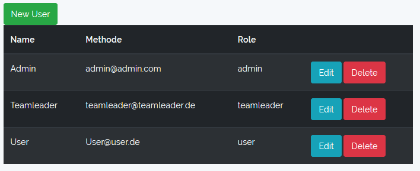
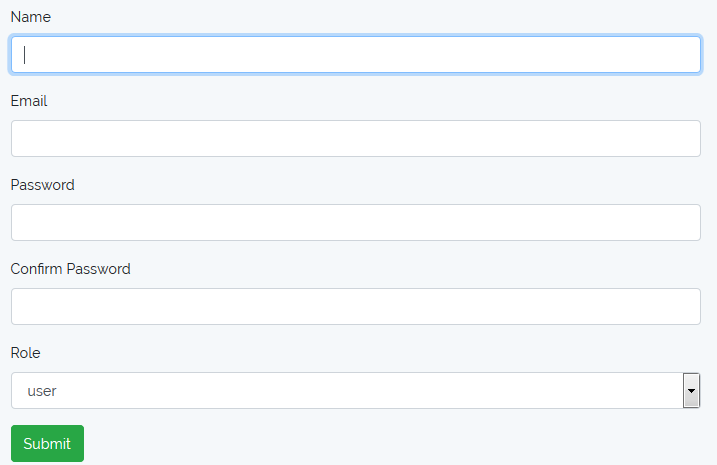
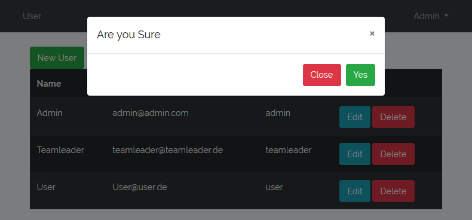
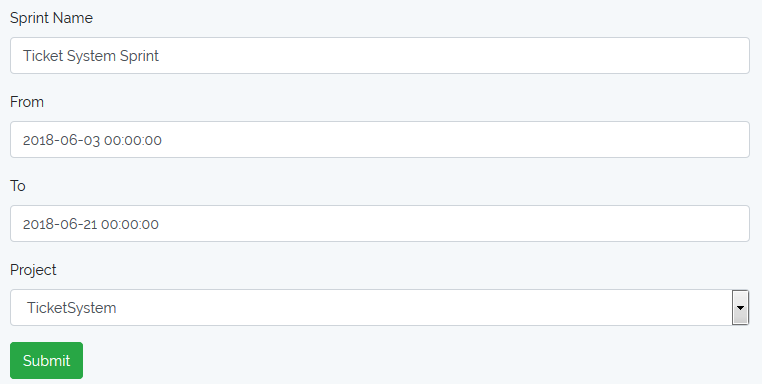
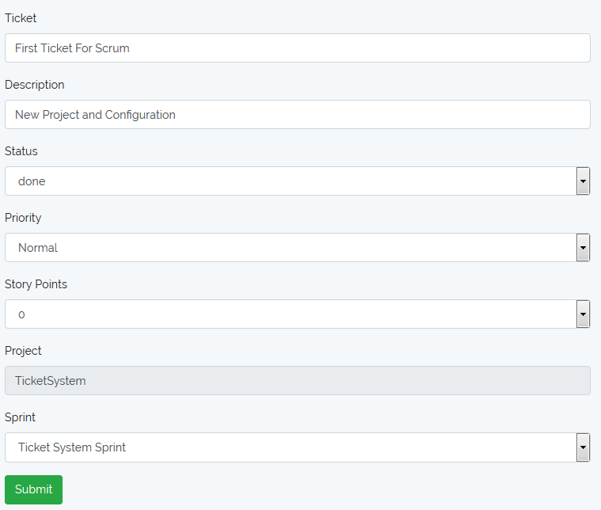
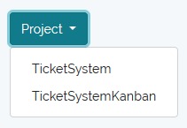
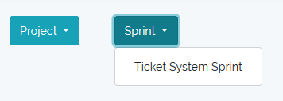
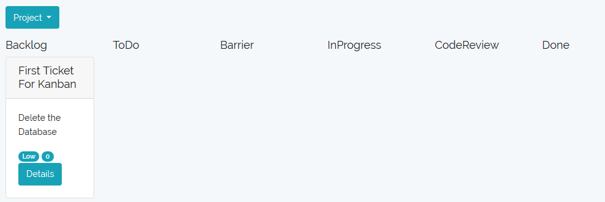
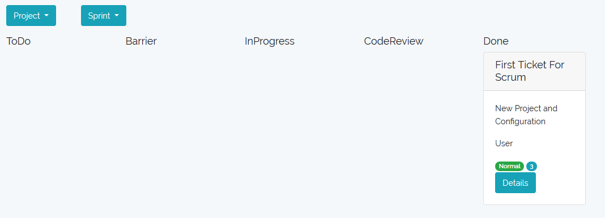
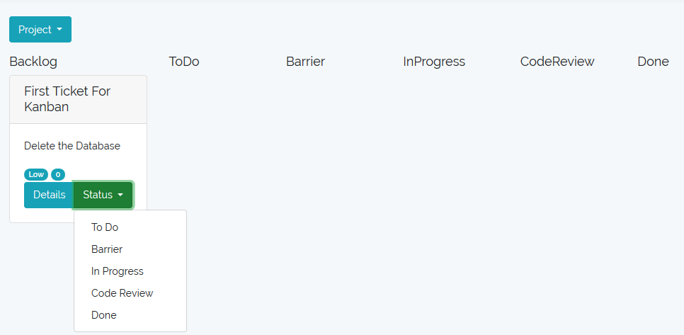

# Table of contents
- [Requirement](#requirement)
- [Installation](#installation)
  - [Installation the Project](#install-the-project)
  - [MySQL / MariaDB](#mysql--mariadb)
    - [First way](#first-way)
    - [Second way](#second-way)
      - [Editor](#editor)
      - [Database](#database)
  - [Terminal](#terminal)
    - [Navigate to Project](#navigate-to-project)
    - [For Developer](#for-developer)
    - [For Live Server](#for-live-server)
    - [Check the Project with PhpUnit](#check-the-project-with-phpunit)
- [Guide](#guide)
    - [No User Authenticate](#no-user-authenticate)
      - [Login View](#login-view)
      - [Behind the Authenticate](#behind-the-authenticate)
    - [Authenticate as Admin](#authenticate-as-admin)
      - [Navigation bar from Admin](#navigation-bar-from-admin)
      - [User View](#user-view)
      - [New User](#new-user)
      - [Edit User](#edit-user)
      - [Delete User](#delete-user)
    - [Authenticate as Team leader](#authenticate-as-team-leader)
      - [Navigation bar from Team leader](#navigation-bar-from-team-leader)
      - [Create View](#create-view)
      - [New Project](#new-project)
      - [Edit Project](#edit-project)
      - [Delete Project](#delete-project)
      - [New Sprint](#new-sprint)
      - [Edit Sprint](#edit-sprint)
      - [Delete Sprint](#delete-sprint)
      - [New Ticket](#new-ticket)
      - [Edit Ticket](#edit-ticket)
      - [Delete Ticket](#delete-ticket)
      - [Dashboard View](#dashboard-view)
      - [Kanban View](#kanban-view)
      - [Details View](#details-view)
      - [Scrum View](#scrum-view)
      - [Dashboard Scrum Details View](#dashboard-scrum-details-view)
    - [Authenticate as User](#authenticate-as-user)
      - [Dashboard](#dashboard)

# Requirement
- [Composer](https://getcomposer.org/)
- [MySQL](https://www.mysql.com/de/) / [MariaDB](https://mariadb.org/)
- [Apache](https://httpd.apache.org/) / [Nginx](https://www.nginx.com/)
- [Xdebug](https://xdebug.org/)

# Installation
## Install the Project        
- Copied the Project in your Web root Directory.
- Open the Terminal and Navigate to the Project.
  - `composer update`
  - `cp .env.example .env`

## MySQL / MariaDB
Start the Database

### First way
- `CREATE DATABASE ticket`
- `CREATE USER 'ticket'@'localhost' IDENTIFIED BY '2QJtitPkuRY3fz7s';`
- `GRANT ALL PRIVILEGES ON ticket . * TO 'ticket'@'localhost';`
- `FLUSH PRIVILEGES;`

### Second way
#### Editor
- Open the File .env with a Editor and look at the entries.
- `DB_DATABASE= [Your Database]`
- `DB_USERNAME= [Your User]`
- `DB_PASSWORD= [Your Password]`

#### Database
- `CREATE DATABASE [Your Database]`
- `CREATE USER '[Your User]'@'localhost' IDENTIFIED BY '[Your Password]';`
- `GRANT ALL PRIVILEGES ON [Your Database] . * TO '[Your User]'@'localhost';`
- `FLUSH PRIVILEGES;`

## Terminal
### Navigate to Project
  - `php artisan migrate:fresh`
  - `php artisan db:seed`

### For Developer
- `php artisan serve`
- Open your Browser and go to [localhost:8000](http://localhost:8000)

### For Live Server
- Follow the [Instruction](https://laravel.com/docs/5.6#web-server-configuration) on Server Configuration for Apache or Nginx

## Check the Project with PhpUnit
- `vendor/bin/phpunit`
- you only see points this is correct and you can start.

# Guide
This user Guide is for all users who want to get a new Ticket System for Scrum and Kanban.

## No User Authenticate
In the Pictures is a Navigation bar. You can navigate to Home and Login Site.

### Login View
In the Form give it email and Password input fields submit the Form to check the authenticated.

If your email and a Password correct then can you work with the Ticket System.

### Behind the Authenticate
The Logout button is in the Drop-down menu from your User name.

## Authenticate as Admin
### Navigation bar from Admin
In the Pictures is a Navigation bar. You can navigate to User or you have a drop down menu with the Logout button.

### User View
In the User page see you all Users with their Roles. You have three Buttons to New, Edit or Delete Users.

### New User
By new User give it four Input Fields and one Select field. In the select field give you the Role (User, Team leader or Admin) from the new User.

### Edit User
The form edit user is for update a User.

### Delete User
If you click on delete button is open a Modal „Are you Sure” you can click on yes to delete a user or close and a Modal is close.

## Authenticate as Team leader
### Navigation bar from Team leader
In the Pictures is a Navigation bar. You can navigate to Dashboard, New or you have a drop down menu with the Logout button.

### Create View
In the Page see you the new navigation bar with three buttons Project, Sprint and Ticket. You can show all Projects, Sprint and Tickets under this right tab.

### New Project
By new Project can you create a new Project with the name and methods (Scrum or Kanban).

### Edit Project
In the Page Edit Project can you Update the Project.

### Delete Project
If you click on delete button is open a Modal „Are you Sure” you can click on yes to delete a Project or close and a Modal is close.

Do not worry it will not be deleted there will be a flags in the database law.

### New Sprint
By the Page New Sprint can you create a new Sprint with a name and a time span and over a Select field can you select a Project.

### Edit Sprint
In the View can you update the sprint.

### Delete Sprint
If you click on delete button is open a Modal „Are you Sure” you can click on yes to delete a Sprint or close and a Modal is close.

Do not worry it will not be deleted there will be a flags in the database law.

### New Ticket
You can create a Ticket on the Page with name and description over a Select field can you select the Project.

### Edit Ticket
By The Page Edit Ticket have you more Option you can Status, Priority and Story Point select. Is the Project Scrum can you select the Sprint.

### Delete Ticket
If you click on delete button is open a Modal „Are you Sure” you can click on yes to delete a Ticket or close and a Modal is close.

Do not worry it will not be deleted there will be a flags in the database law.

### Dashboard View
On this Picture can you select a project if the Project Kanban can you see the Story’s from the Project or it is Scrum then select a Sprint and you see the Tickets.

### Kanban View
This Project is Kanban and you can see the Tickets from this Project.

### Details View
On this view can you see the Details from the Ticket.

### Scrum View
On this View is a Project and a Sprint Selected you can see the Tickets.

### Dashboard Scrum Details View
This view is show all Ticket and Details from a Sprint.

## Authenticate as User
### Dashboard
The View is like a Team leader Dashboard you have a new select field with status.

